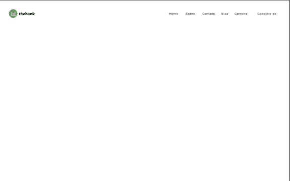
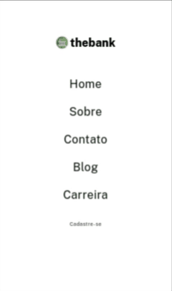
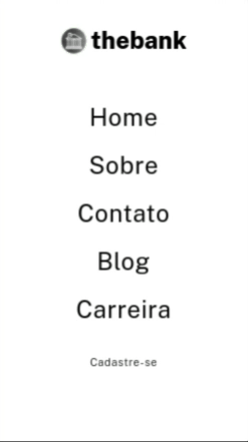

# Menu com Flexbox

#### Menu com Flexbox faz parte dos exercícios de CSS avançado do curso de formação Fullstack da DEV QUEST - Dev em Dobro. O exercício tem o objetivo de consolidar conceitos avançados de CSS. Obrigado por conferir o meu cógigo.

## Índice

- [Captura de tela](#captura-de-tela)
- [Links](#links)
- [Construído com](#construído-com)
- [O que aprendi](#o-que-aprendi)
- [Desenvolvimento contínuo](#desenvolvimento-contínuo)
- [Recursos úteis](#recursos-úteis)
- [Fernando Mendes](#autor)

### Captura de tela

#### Tela Desktop



#### Tela Ipad



#### Tela Mobile



### Links

- Site URL: https://nandosti.github.io/menu-flexbox/

### Construído com

<div style="display: inline_block"><br>
  
         
</div>

## O que aprendi

Neste projeto explorei e aprimorei minhas habilidades em CSS avançado. A construção da estrutura da página, utilizando propriedades como display, justify-content e align-items, viabilizou criar um layout responsivo. A integração de transições suaves em elementos de navegação, como os botões "Sobre" e "Cadastro", aprimorou a interatividade e a usabilidade do site. Além disso, o uso de media queries para dispositivos móveis reforçou a importância do design responsivo, adaptando o layout e os estilos para oferecer uma experiência em telas menores. Este exercício me proporcionou uma compreensão das práticas de design responsivo e da manipulação de elementos HTML e CSS para criar interfaces funcionais em diversas plataformas.


## Trechos de códigos

```
body{
    font-family: 'Public Sans', sans-serif;
    font-size: 15px;
}

.container{
    display: flex;
    justify-content: space-between;
    align-items: center;
    padding: 45px;
}

.container .logo-title{
    display: flex;
    align-items: center;
    gap: 5px;
}

.container .logo-title img{
    width: 45px;
    height: 42px;
}

.container .logo-title h1{
    font-size: 20px;
    font-weight: 800;
}

.container .menu ul{
    display: flex;
    justify-content: center;
    align-items: center;
    font-weight: 400;
    letter-spacing: 1px;
    gap: 30px;
}

```

## Desenvolvimento contínuo

Pretendo continuar focado em construir um conhecimento sólido nessas tecnologias. Ainda há muitos conceitos importantes para serem desenvolvidos. Todos os dias aprendo novos conceitos que são gradativamente adicionados ao meu repertório de ferramentas.

## Recursos úteis

- [W3School](https://www.w3schools.com/css/default.asp) - Esse site sempre me ajuda a resolver qualquer problema relacionados a códigos de uma maneira fácil e muito rápida.
- [Dev em Dobro](https://www.youtube.com/@DevemDobro) - Este é um canal onde encontro muito material. Tem muito conteúdo relacionado ao desenvolvimento. Recomendo a todos que querem aprender sobre esse e outros conceitos relacionados.

## Autor

[Fernando Mendes](https://www.linkedin.com/in/fernandomendesti/)
